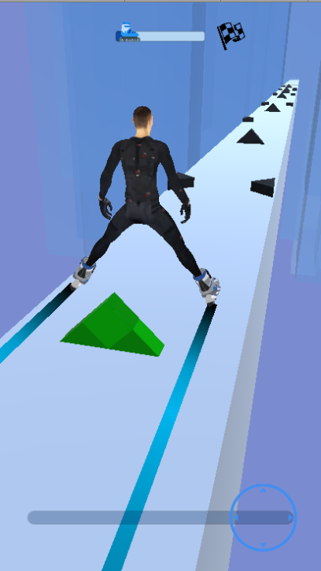
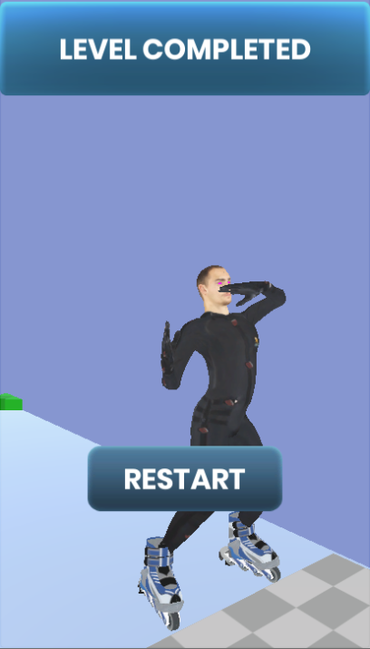
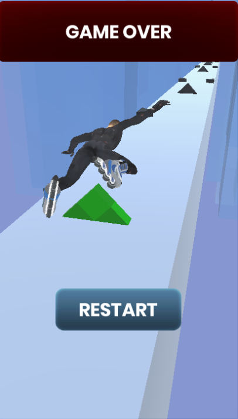

# SkyRoller clone Unity3D
A clone of Game Sky Roller made in Unity3D

Tools:
 - [ Animation Rigging ] - For moving character's leg.
 - [ Pro Builder ] - To create the environment.
 - [ Mixamo ] - for animation and model

[Playable Link](https://guilmegouveia.itch.io/skateroller-clone) 

[GamePlay Video](https://lnkd.in/d-dWWF5) 

